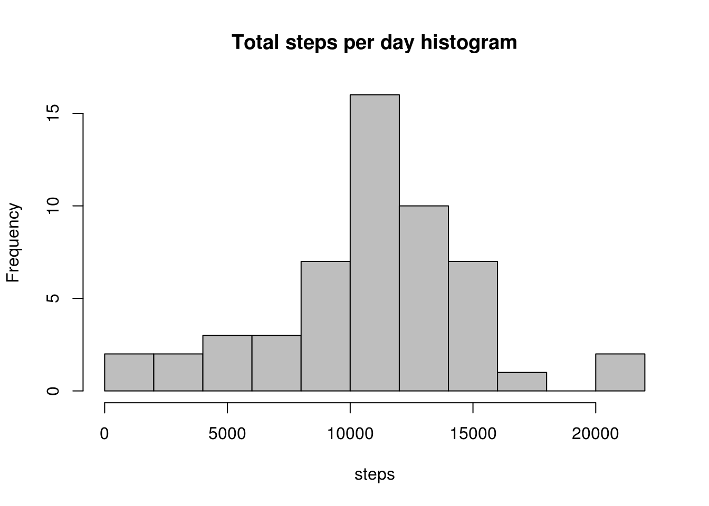
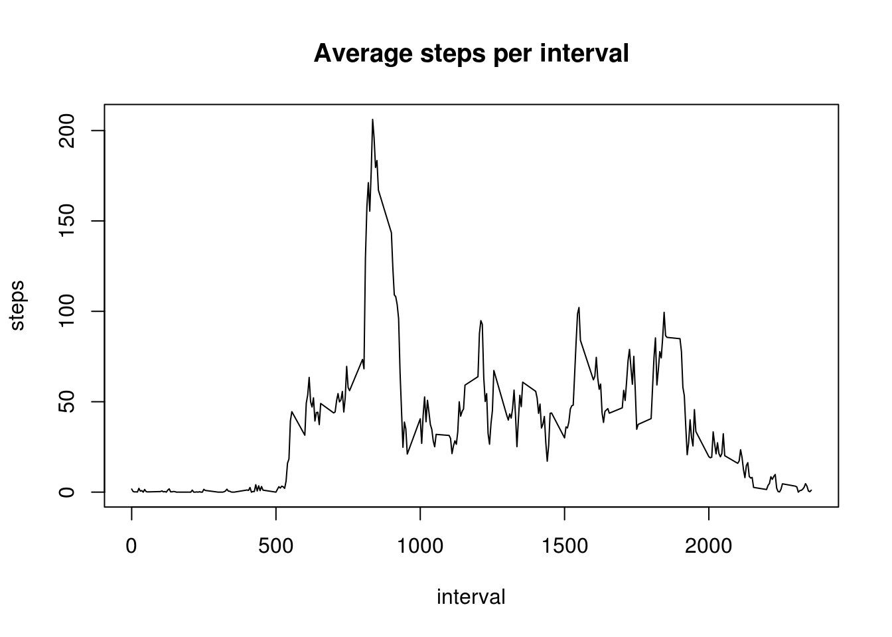
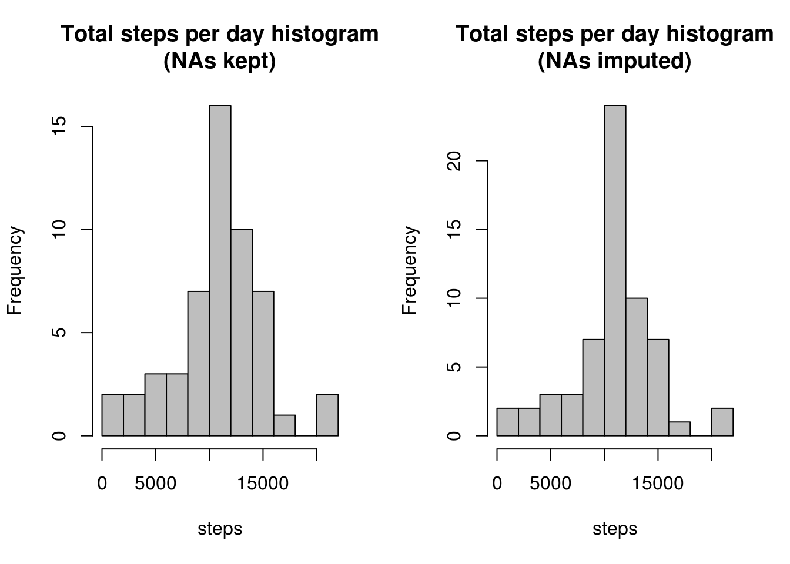
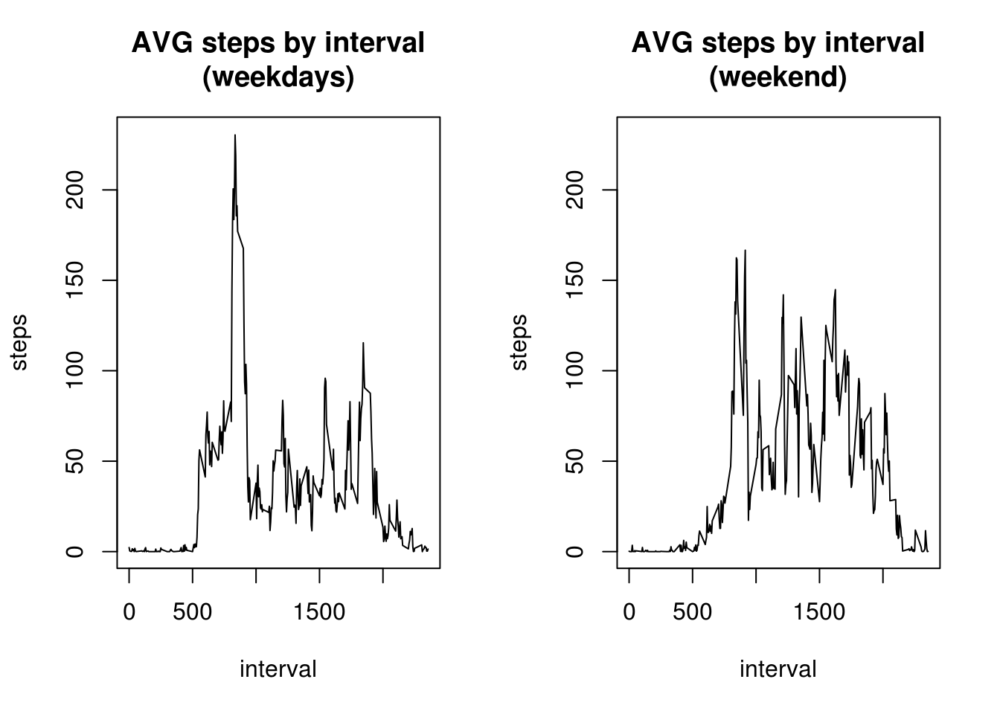

## Loading and preprocessing the data

```r
options(digits=12)
```


Assuming **cwd** is set to the directory where data is located, we can load data directly from the zip file:


```r
content <- unz("activity.zip","activity.csv")
dataset <- read.csv(content,stringsAsFactors = T)
```

We can check data is loaded and looks fine:

```r
head(dataset)
```

```
##   steps       date interval
## 1    NA 2012-10-01        0
## 2    NA 2012-10-01        5
## 3    NA 2012-10-01       10
## 4    NA 2012-10-01       15
## 5    NA 2012-10-01       20
## 6    NA 2012-10-01       25
```

```r
summary(dataset)
```

```
##      steps                     date          interval      
##  Min.   :  0.0000000   2012-10-01:  288   Min.   :   0.00  
##  1st Qu.:  0.0000000   2012-10-02:  288   1st Qu.: 588.75  
##  Median :  0.0000000   2012-10-03:  288   Median :1177.50  
##  Mean   : 37.3825996   2012-10-04:  288   Mean   :1177.50  
##  3rd Qu.: 12.0000000   2012-10-05:  288   3rd Qu.:1766.25  
##  Max.   :806.0000000   2012-10-06:  288   Max.   :2355.00  
##  NA's   :2304          (Other)   :15840
```

## What is mean total number of steps taken per day?

Since we have to respond some questions about total steps per day, we can create a dataset of aggregated data:


```r
agg.date <- aggregate(steps ~ date, dataset, sum)
head(agg.date)
```

```
##         date steps
## 1 2012-10-02   126
## 2 2012-10-03 11352
## 3 2012-10-04 12116
## 4 2012-10-05 13294
## 5 2012-10-06 15420
## 6 2012-10-07 11015
```

Next, we can plot the histogram of total steps per day:

```r
hist(agg.date$steps,breaks=10,xlab="steps",main="Total steps per day histogram",col="gray")
```



As demanded, we can find out the mean and the median for the total number of steps for each day:


```r
summary(agg.date$steps)
```

```
##       Min.    1st Qu.     Median       Mean    3rd Qu.       Max. 
##    41.0000  8841.0000 10765.0000 10766.1887 13294.0000 21194.0000
```

We can observe that the mean is 10766.1887 and the median is 10765.

## What is the average daily activity pattern?

Let's make a time series plot of the 5 minute interval and the average number of steps taken across all days. Since we need also to solve another questions, we can aggregate now by interval:


```r
agg.interval <- aggregate(steps ~ interval,dataset,mean)
head(agg.interval)
```

```
##   interval           steps
## 1        0 1.7169811320755
## 2        5 0.3396226415094
## 3       10 0.1320754716981
## 4       15 0.1509433962264
## 5       20 0.0754716981132
## 6       25 2.0943396226415
```

Now we can plot the data:

```r
plot(agg.interval,type="l",main="Average steps per interval")
```



As can be seen in the plot, the 5-minute interval with the maximum number of steps (on average) is somewhere near the 1000th interval, we can find it exactly:


```r
index <- which.max(agg.interval$steps)
agg.interval$interval[index]
```

```
## [1] 835
```

## Imputing missing values

Let's find out how many missing values do we have:


```r
sapply(names(dataset),function(n) {sum(is.na(dataset[n]))})
```

```
##    steps     date interval 
##     2304        0        0
```

Looks that the only column with missing values is "steps". As a naive strategy, we'll use the interval steps mean to replace missing steps measurements (we have them computed in the ```agg.intervals``` dataframe). We can do this by mergin both datasets based on interval and, after that, doing the replacement:


```r
# join by interval
new.dataset <- merge(dataset,agg.interval,by="interval")
# find out which rows we want to fix
to_replace <- is.na(new.dataset$steps.x)
# fix them
new.dataset[to_replace,]$steps.x <- new.dataset[to_replace,]$steps.y
# keep original order
new.dataset <- new.dataset[order(new.dataset$date,new.dataset$interval),]
# remove additional column (mean)
new.dataset$steps.y <- NULL
# fix names
names(new.dataset) <- gsub("steps.x","steps",names(new.dataset))
```

Now, we can check that we don't have NAs anymore:

```r
sapply(names(new.dataset),function(n) {sum(is.na(new.dataset[n]))})
```

```
## interval    steps     date 
##        0        0        0
```

Now we can a new histogram of the total number of steps per day with the modified dataset and compare it with the previous one:


```r
newagg.date <- aggregate(steps ~ date, new.dataset, sum)
head(newagg.date)
```

```
##         date         steps
## 1 2012-10-01 10766.1886792
## 2 2012-10-02   126.0000000
## 3 2012-10-03 11352.0000000
## 4 2012-10-04 12116.0000000
## 5 2012-10-05 13294.0000000
## 6 2012-10-06 15420.0000000
```

Next, we can plot the histogram of total steps per day:

```r
par(mfrow=c(1,2))
hist(agg.date$steps,breaks=10,xlab="steps",main="Total steps per day histogram\n(NAs kept)",col="gray")
hist(newagg.date$steps,breaks=10,xlab="steps",main="Total steps per day histogram\n(NAs imputed)",col="gray")
```



As demanded, we can find out the mean and the median for the total number of steps for each day:


```r
summary(newagg.date$steps)
```

```
##       Min.    1st Qu.     Median       Mean    3rd Qu.       Max. 
##    41.0000  9819.0000 10766.1887 10766.1887 12811.0000 21194.0000
```

We can observe that the mean is 10766.1887 and the median is 10766.1887.


## Are there differences in activity patterns between weekdays and weekends?

To answer this question firt we need to add a new variable (factor variable telling whether the observation corresponds to a weekday or a weekend), and assign each row (observation) its corresponding value.


```r
# add day of week [1..7] to each observation
new.dataset$day.of.week <- strftime(as.Date(new.dataset$date),"%u")
# add a new column for day type, by default "weekday" for all observations
new.dataset$day.type <- "weekday"
# now make a mask corresponding to saturdays and sundays (in my country, those are the weekend days)
weekend.rows <- new.dataset$day.of.week == 6 | new.dataset$day.of.week==7
# now we can update those rows with their right value: "weekend"
new.dataset[weekend.rows,"day.type"] <- "weekend"
# convert the day.type column to factor
new.dataset$day.type <- as.factor(new.dataset$day.type)
head(new.dataset)
```

```
##     interval           steps       date day.of.week day.type
## 1          0 1.7169811320755 2012-10-01           1  weekday
## 63         5 0.3396226415094 2012-10-01           1  weekday
## 128       10 0.1320754716981 2012-10-01           1  weekday
## 205       15 0.1509433962264 2012-10-01           1  weekday
## 264       20 0.0754716981132 2012-10-01           1  weekday
## 327       25 2.0943396226415 2012-10-01           1  weekday
```

Once we have the new column, we can plot the two diferent subsets (weekday/weekend) in a panel.


```r
# aggregate (mean) by interval/daytype
by.dtype <- aggregate(steps ~ interval + day.type, new.dataset,mean)
# compute masks for selecting weekdays/weekends
weekdays = by.dtype$day.type == "weekday"
weekends = by.dtype$day.type == "weekend"
# in order to compare, use the same scale for the Y axis, here we compute
# its maximum value (max steps) and add 1 to it 
maxy <- round(max(by.dtype$steps))+1
# let's create 1x2 panel
par(mfrow=c(1,2))
plot(by.dtype$interval[weekdays],by.dtype$steps[weekdays],type="l",ylim=c(0,maxy),
     xlab="interval",
     ylab="steps",
     main="AVG steps by interval\n(weekdays)")
plot(by.dtype$interval[weekends],by.dtype$steps[weekends],type="l",ylim=c(0,maxy),
     xlab="interval",
     ylab="steps",
     main="AVG steps by interval\n(weekend)")
```



Well, looks like our subject test walks a little bit more during weekend days and also he/she starts moving later, let's find out:


```r
weekdays.data <- by.dtype[weekdays,]
weekends.data <- by.dtype[weekends,]
max.wd <- weekdays.data$interval[which.max(weekdays.data$steps)]
max.we <- weekends.data$interval[which.max(weekends.data$steps)]
sprintf("Weekdays max: %d. Weekends max: %d",max.wd,max.we)
```

```
## [1] "Weekdays max: 835. Weekends max: 915"
```

If we take as start of intervals 00:00 in the midnight, 835 corresponds to 8:35 in the morning. Perhaps our test subject walks to his job? On the other side, 915 would correspond to 9:15, so perhaps our test subject stays a bit longer in bed during weekends (despite the fact that, after waking up, his walking activity is higher than on weekdays)
